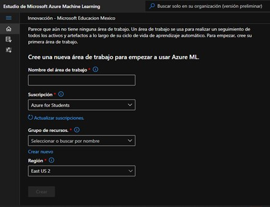
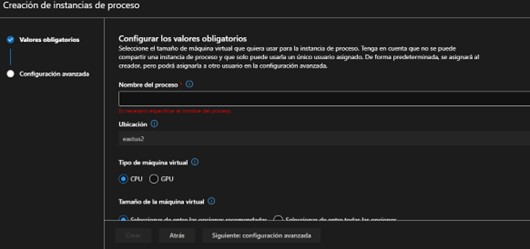
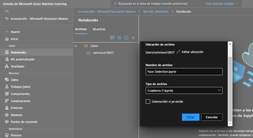
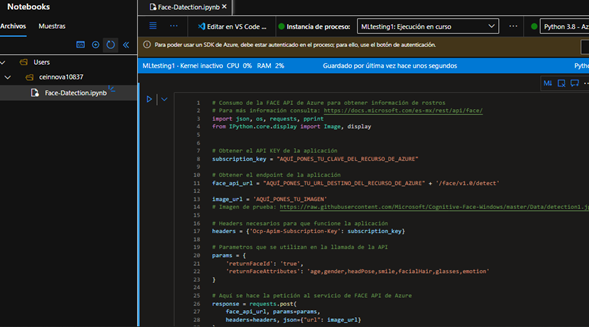
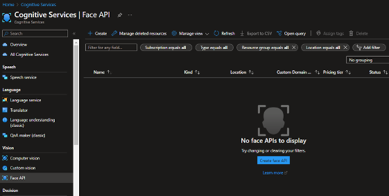
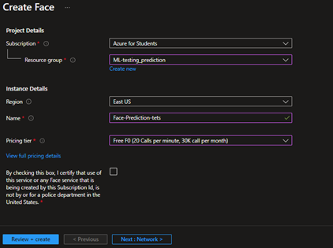
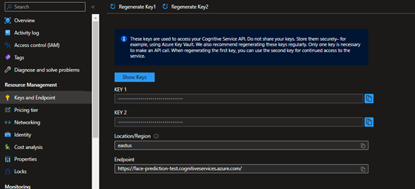
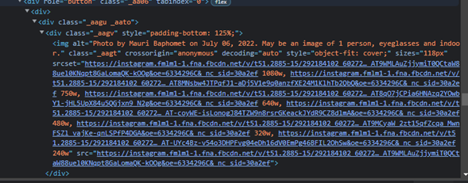

# Face Detection.

**Introducción**.

Esta es una práctica de Azure donde haremos uso de los Cognitive Services y un código echo en Python para crear una IA que nos ayude a identificar rostros, si trae lentes, que emoción predomina en la imagen, edad y género.

-----------------------------------------
### Paso 1: Crea una área de trabajo en ML Studio

Para crear una área de trabajo en ML Studio deberas contar con una suscripción activa en [Azure](https://azure.microsoft.com/es-es/get-started/azure-portal/) o crear una gratuita de estudiante.

Para ingresar más fácilmente al ML Studio puedes hacerlo desde [Aquí](https://ml.azure.com/)

Una vez que hayas ingresado, crea tu área de trabajo.

-------------------------------------
### Paso 2: Crea una instancia de proceso.

Cuando tu área de trabajo este lista ingresa a ella y busca del lado lateral izquierdo **Instancia de proceso**.

- Puedes elegir entre CPU y GPU.
- Selecciona el tamaño de la maquina que te permita o utilizar la recomendada (Estándar_DS11_v2).
- Al finalizar dale clic en crear.

------------------------------------------
### Paso 3: Creación de un NoteBook.

Una vez finalizada la tarea del paso anterior, busca en el lateral izquierdo **Notebooks** y crea uno.

- Dale el nombre que gustes pero no elimines el .ipynb, ya que haremos uso de un Jupiter NoteBook.

Ahora copiarás el *código* de python que se lo encontraras como **CodeAPI.py**, el cual fue proporcionado por [José Jesús Guzman](https://github.com/josejesusguzman/face-api-consumption-python)

1.- Para copiar este código de forma más rapida entraras a la carpeta donde está el código de python:
    ° Buscaras "Raw"
    ° Presionar Ctrl + a
    ° Presiona Ctrl + c
    ° En tu NoteBook preiona Ctrl + v

--------------------------------
### Paso 4: Uso de Azure Cognitives Services.

- Ingresa al [Portal de Azure](https://portal.azure.com/) con tu cuenta y y es la barra de busqueda escribe: **Face APIs** o en español *Api de Face*.

- Crea una.

    - Dale el nombre que gustes.
    - Plan de tarifa: selecciona el gratuito.
    - Caundo termines da clic en revisar y crear.

- Una vez creada tu Face API ve al recurso y busca en el lado izquierdo **Claves y puntos de conecxión**

     - La **clave 1** copeala y pegala en el código de tu  Notebook donde dice: **susbcription key**.
     - Copea el **extremo o endpoint** en donde dice **fase_api_url**.

-------------
### Paso 5: Realizar las predicciones.

Ahora puedes buscar alguna foto en una red social o usar el navegador para buscar imagenes y copea su dirección en el código donde dice **image_url** y corre el programa.

En caso de que no sepas como obtener las direcciones de las imagenes te muestro como.
- Entra a la imagen de alguna red social y dale cic derecho.
    - Busca inspeccionar y dale clic.
- Vuelve a seleccionar la imagen y busca en el codigo pasando el cursor del mouse por encima del código hasta que seleccione toda la imagen.
- En donde te haya seleccionado toda la imagen busca **scr** y copea todo el link.

- En caso de una imagen de google.
    - Busca una imagen.
    - Dale clic derecho.
    - Dale clic en copear dirección de la imagen.
    - Pegala donde mencione anteriormente y corre el programa.
